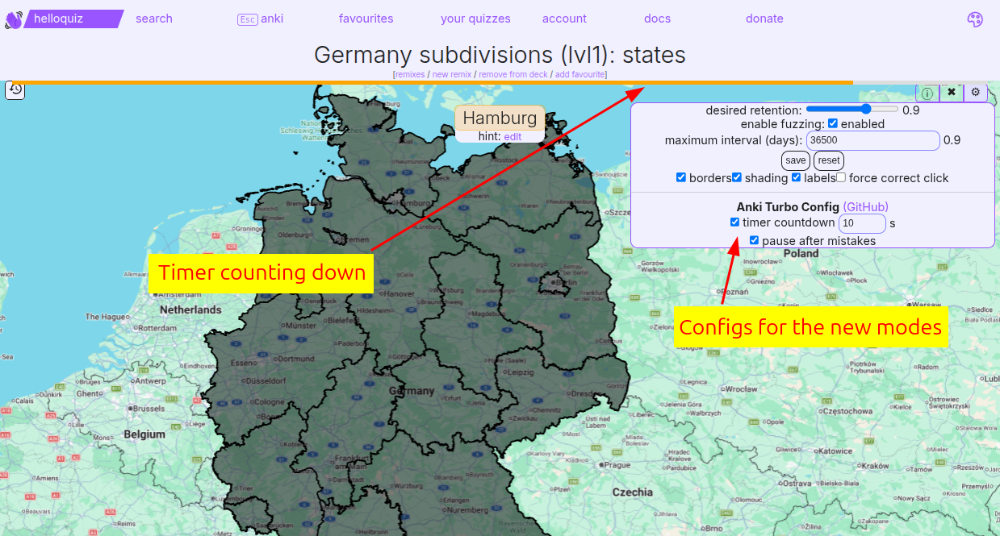

# HelloQuiz Anki Turbo

A [Tampermonkey](https://www.tampermonkey.net/) / [Violentmonkey](https://violentmonkey.github.io/) userscript that adds Anki-mode enhancements to [helloquiz.app](https://helloquiz.app): a per-question countdown that auto-fails cards you answer too slowly, a review pause after mistakes, and keyboard shortcuts.

## Features

- **Per-question countdown** — a thin timer bar counts down from a configurable number of seconds. When it runs out, the card is automatically graded as failed ("again"), so slowly scanning the map for the right city/region gets penalized automatically.
- **Review pause after mistakes** — when you answer wrong (or time out), the quiz pauses on the current card so you can study and learn it before moving on.
- **Settings** — the quiz's settings panel is extended, so that you can enable/disable the countdown timer, set the timer duration, and enable/disable the review pause. All settings are remembered across sessions.
- **Keyboard shortcuts** with matching on-screen key badges:
  - <kbd>1</kbd> / <kbd>2</kbd> / <kbd>3</kbd> / <kbd>4</kbd> — grade the current card (again / hard / good / easy), or open quiz rows 1–4 on the `/learn` list.
  - <kbd>1</kbd> / <kbd>2</kbd> / <kbd>3</kbd> — end-of-quiz navigation: practice more (`▶`) / select quiz (`⇋`) / next quiz (`→`).
  - <kbd>Esc</kbd> — jump back to the `/learn` (anki mode) list.
- **Auto pause/resume** — the countdown pauses when you switch tabs or the window loses focus, and resumes where it left off when you come back.

## Installation

1. Install a userscript manager such as [Tampermonkey](https://www.tampermonkey.net/) or [Violentmonkey](https://violentmonkey.github.io/).
2. Install the script from its [raw URL](https://raw.githubusercontent.com/jakobkogler/helloquiz-app/main/helloquiz-anki-turbo.user.js) — most userscript managers will detect it and prompt to install. Alternatively, open `helloquiz-anki-turbo.user.js` and let the manager install it (or add it as a new script and paste the contents).
3. Navigate to an [Anki-mode page on helloquiz.app](https://helloquiz.app/learn) — the script activates automatically.

> **Note:** This currently works best with the app's **"force correct click"** setting **disabled**. With it enabled the review pause doesn't behave correctly (in particular on city quizzes), so leave it off for now.

## Screenshots

The countdown bar across the top, and the *Anki Turbo Config* options in the quiz's settings panel:

Keyboard-shortcut badges and labels on the buttons:

The review pause after a wrong answer, so you can study the map you just missed — it works even on city quizzes:

