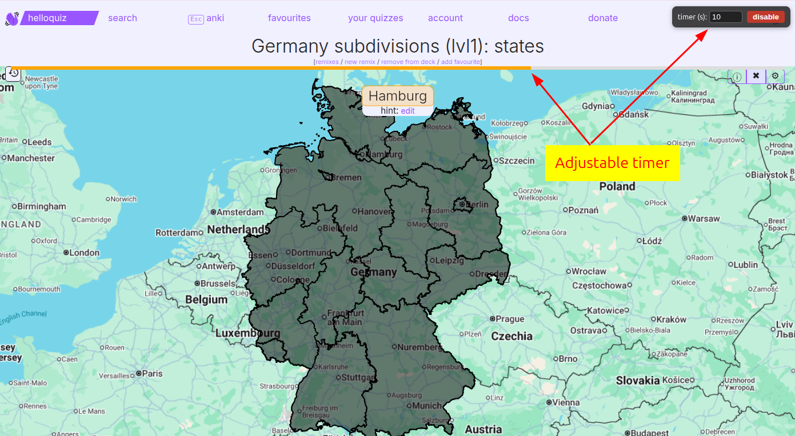
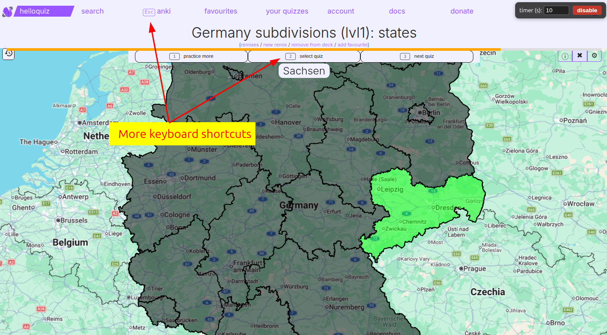
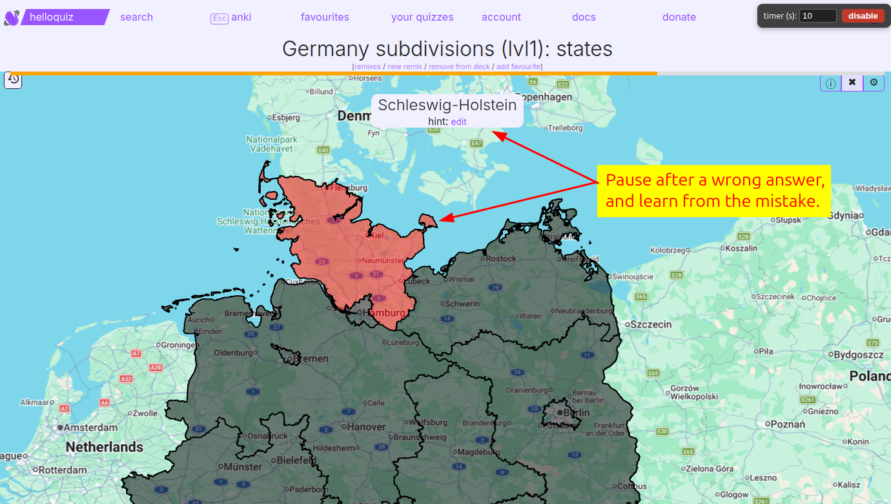

# HelloQuiz Anki Turbo

A [Tampermonkey](https://www.tampermonkey.net/) / [Violentmonkey](https://violentmonkey.github.io/) userscript that adds Anki-mode enhancements to [helloquiz.app](https://helloquiz.app): a per-question countdown that auto-fails cards you answer too slowly, a review pause after mistakes, and keyboard shortcuts.

## Features

- **Per-question countdown** — a thin timer bar counts down from a configurable number of seconds. When it runs out, the card is automatically graded as failed ("again"), so slowly scanning the map for the right city/region gets penalized automatically.
- **Review pause after mistakes** — when you answer wrong (or time out), the quiz pauses on the current card so you can study and learn it before moving on.
- **Keyboard shortcuts** with visible `kbd` badges:
  - `1`–`4` — grade the current card (again / hard / good / easy), or open quiz rows 1–4 on the `/learn` list.
  - `1` / `2` / `3` — end-of-quiz navigation: practice more (`▶`) / select quiz (`⇋`) / next quiz (`→`).
  - `Esc` — jump back to the `/learn` (anki mode) list.
- **Auto pause/resume** — the countdown pauses when you switch tabs or the window loses focus, and resumes where it left off when you come back.
- **Control panel** — a small overlay (top-right) to set the timer duration and toggle the timer on/off. Both are remembered across sessions.

## Installation

1. Install a userscript manager such as [Tampermonkey](https://www.tampermonkey.net/) or [Violentmonkey](https://violentmonkey.github.io/).
2. Install the script from its [raw URL](https://raw.githubusercontent.com/jakobkogler/helloquiz-app/main/helloquiz-anki-turbo.user.js) — most userscript managers will detect it and prompt to install. Alternatively, open `helloquiz-anki-turbo.user.js` and let the manager install it (or add it as a new script and paste the contents).
3. Navigate to an [Anki-mode page on helloquiz.app](https://helloquiz.app/learn) — the script activates automatically.

## Screenshots

The countdown bar across the top and the adjustable-timer control panel in the corner:

Keyboard-shortcut badges and labels on the buttons:

The review pause after a wrong answer, so you can study the card you just missed:

