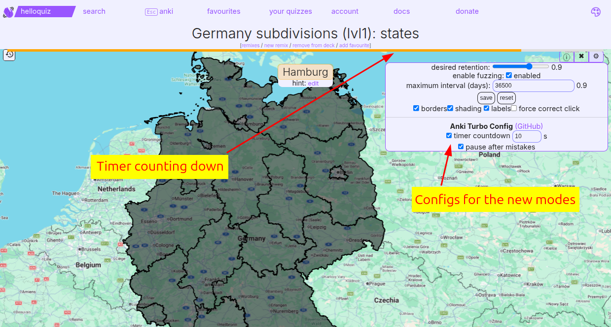
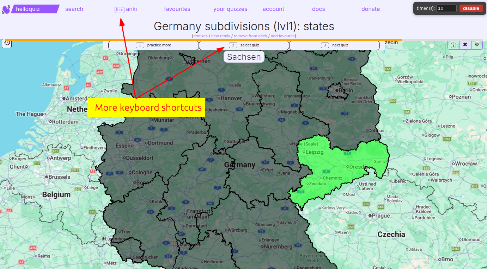
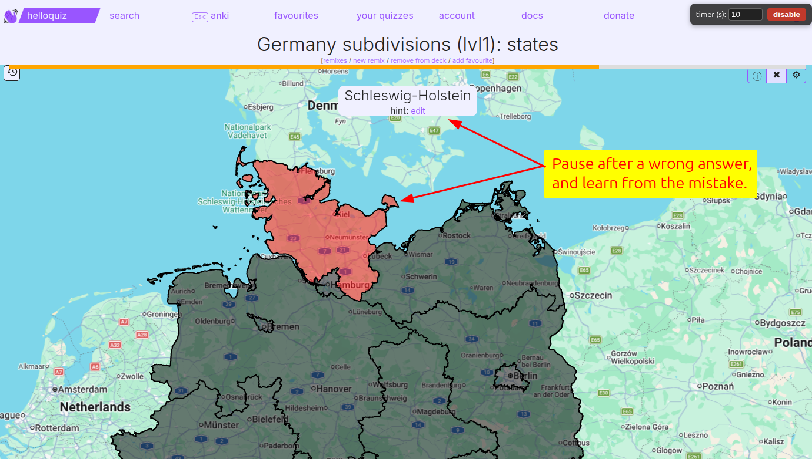

# HelloQuiz Anki Turbo

A [Tampermonkey](https://www.tampermonkey.net/) / [Violentmonkey](https://violentmonkey.github.io/) userscript that adds Anki-mode enhancements to [helloquiz.app](https://helloquiz.app): a per-question countdown that auto-fails cards you answer too slowly, a review pause after mistakes, and keyboard shortcuts.

## Features

- **Per-question countdown** — a thin timer bar counts down from a configurable number of seconds. When it runs out, the card is automatically graded as failed ("again"), so slowly scanning the map for the right city/region gets penalized automatically. The bar's color previews the auto-grade zones below as it counts down — green, then orange, then red — whether or not auto-grading is actually turned on.
- **Auto-grade by speed** (off by default) — when a question is answered correctly in time, the card grades itself from how much of the countdown was left, instead of asking you for *hard* / *good* / *easy*. The two thresholds are configurable percentages of the countdown, by default 66% and 33%: with the default 10 second countdown an answer within 3.4s is *easy*, within 6.7s *good*, and anything slower *hard*. Answering too slowly still fails the card as before. Needs the countdown to be enabled.
- **Review pause after mistakes** — when you answer wrong (or time out), the quiz pauses on the current card so you can study and learn it before moving on. This replaces the app's own **"force correct click"** mode, which doesn't work correctly for city quizzes — the review pause gives you the same "look at the right answer before continuing" effect on every quiz type.
- **Adjusted hints** — the hint below the question (and its *display* / *edit* actions) always belongs to the question you actually see, so viewing and changing hints works even in the pause mode and on the grading and end-of-quiz screens.
- **Link to the normal quiz** — the action list next to the quiz title gets a *normal quiz* link, which opens the same quiz outside of anki mode.
- **Open all due quizzes at once** — a button next to the *quizzes* heading on `/learn` opens every quiz that has overdue questions in its own tab, so a study session starts with exactly the quizzes that need work. This needs pop-ups to be allowed (see the note below).
- **Settings** — the quiz's settings panel is extended, so that you can enable/disable the countdown timer, set the timer duration, enable/disable auto-grading (and its two thresholds), and enable/disable the review pause. The timer duration defaults to one value for all quizzes, but you can override it per quiz — tick *quiz timer override* while in a quiz to give just that one its own duration. Each setting has a **?** next to it that shows a short explanation of what it does. All settings are remembered across sessions and sync instantly to every other helloquiz.app tab open in the same browser, but are stored locally, so they are not synced across devices.
- **Keyboard shortcuts** with matching on-screen key badges:
  - <kbd>1</kbd> / <kbd>2</kbd> / <kbd>3</kbd> / <kbd>4</kbd> — grade the current card (again / hard / good / easy)
  - <kbd>1</kbd> / <kbd>2</kbd> / <kbd>3</kbd> — end-of-quiz navigation: practice more (`▶`) / select quiz (`⇋`) / next quiz (`→`).
  - <kbd>Esc</kbd> — jump back to the `/learn` (anki mode) list.
  - <kbd>1</kbd> / <kbd>2</kbd> / <kbd>3</kbd> / <kbd>4</kbd> open the first / second / third / forth quiz in the list
- **Auto pause/resume** — the countdown pauses when you switch tabs or the window loses focus, and resumes where it left off when you come back.

## Installation

1. Install a userscript manager such as [Tampermonkey](https://www.tampermonkey.net/) or [Violentmonkey](https://violentmonkey.github.io/).
2. Install the script from its [raw URL](https://raw.githubusercontent.com/jakobkogler/helloquiz-app/main/helloquiz-anki-turbo.user.js) — most userscript managers will detect it and prompt to install. Alternatively, open `helloquiz-anki-turbo.user.js` and let the manager install it (or add it as a new script and paste the contents).
3. Navigate to an [Anki-mode page on helloquiz.app](https://helloquiz.app/learn) — the script activates automatically.

> **Note:** This currently works best with the app's **"force correct click"** setting **disabled**. With it enabled the review pause doesn't behave correctly (in particular on city quizzes), so leave it off for now — the review pause covers the same use case.

> **Note:** The script currently only works correctly in the app's **compact** quiz mode. In the full-map mode some parts (e.g. the settings panel additions) don't display properly yet.

> **Note:** The *open … due quizzes* button opens several tabs at once, which browsers block by default. On the first click you will likely get only one tab (or none) plus a "pop-ups blocked" hint in the address bar — **allow pop-ups for helloquiz.app** there and click the button again. The script shows a banner telling you how many tabs were blocked, so you always know it happened.

## Development

The regression suite uses Node's built-in test runner and has no package
dependencies:

```bash
npm test
```

It checks that the userscript parses, that selectors do not pin generated
CSS-module hashes from a particular helloquiz.app build, and that quiz-list
discovery stays anchored to learn-mode links.

## Screenshots

The countdown bar across the top, and the *Anki Turbo Config* options in the quiz's settings panel:



Keyboard-shortcut badges and labels on the buttons:



The review pause after a wrong answer, so you can study the map you just missed — it works even on city quizzes:


